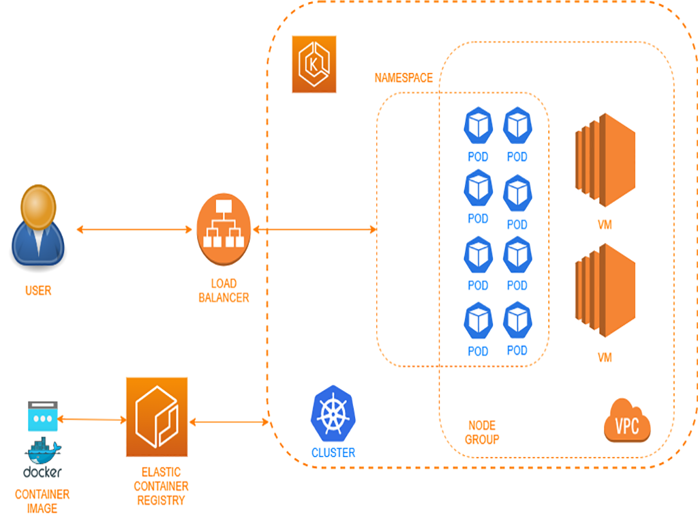

# Deploy a web application in amazon elastic kubernetes services.



# Outline:
1) Create Role and policy for EKS
2) Create ECR repository
3) Create docker image and push to the ECR repository
4) Create an Elastic Kubernetes Cluster
5) Create a Node Group for Elastic Kubernetes Cluster
6) Deploy an application in Elastic Kubernetes Cluster
7) Scale out the Elastic Kubernetes Cluster
8) Clean up the project environment and avoid future costs

# Create Role and Policy for EKS

- Create AWS credentials key (if you wish the create for this project)
- On the AWS console: Policies >>> Create policy >>> paste json format (content of policy.txt) >>> Give name(`MyEKSPolicy`) and Create policy.

- Left hand menu click Roles >>> Create role >>> AWS service >>> Select EKS >>> EKS - Cluster >>> Next >>> Give role name (`EKS-Cluster-Role`) and Create Role. 

- Create second role for Node group configuration.
Create Role >>> AWS Service >>> Select EC2 >>> EC2 >>> Permission >>> Chose Policies (`AmazonEKSWorkerNodePolicy`, `AmazonEC2ContainerRegistryReadonly`, `AmazonEKS_CNI_Policy`,`MyEKSPolicy`) >>> Next >>> Give role name (`Node-Group-Role`) and Create Role. 

# AWS Configuration with credentials.

- $ aws configure

# Create ECR repository

- ECR >>> private >>> Give name (`website`) >>> create

# Clone the project folder repository to the ec2 home directory.

- Docker must be installed to the ec2 (ubuntu machine)

- Create Docker image.
$ cd web-container-applications
$ sudo docker build -f Dockerfile -t website:latest . 
$ sudo docker images
$ sudo docker run -p 8089:8089 website:latest

- Check docker container must be running
```
$ sudo docker ps
$ sudo docker stop `containerid`

- Send docker image to the ECR

AWS Console >>> ECR >>> select `website` >>> push commands (Enter the commands to the terminal)
$ aws ecr get-login-password --region us-east-1 | sudo docker login ....
$ Enter the third command (don't forget to write `sudo` before docker) 
$ Enter the fourth command
```
# Create an Elastic Kubernetes Cluster

AWS Console >>> EKS >>> create cluster >>> name:`my_cluster` >>> version:1.20 >>> role: EKS-role >>> Default VPC >>> chose subnet-a and subnet-b >>> select default-sec-grp >>> public >>> Next >>> create

# Create a Node Group for Elastic Kubernetes Cluster

- See the cluster created AWS Console >>> EKS >>> Clusters >>> my_cluster(active) >>> Configuration >>> Compute >>> Add Node Group >>> name: `my_node_group` >>> select role (Node-Group-Role) >>> Next >>> define machine for Node group (Instance type:t3.medium, min:2, max:4, desired:2) >>> two subnets and ssh key pair and `All` >>> create

# Deploy an application in Elastic Kubernetes Cluster

- We will use deployment.yaml file. For configuration, Go to terminal;

$ aws eks --region us-east-1 update-kubeconfig --name my_cluster
$ kubectl get nodes    
- See the nodes are ready

- On the deployment.yaml file (First part is for deployment): application name: website, replicas decided to be 5 and enter image name:'Copy URI in ECR repository of latest image' and save.
- (Second part is `service` for we choose `loadbalancer` for service)

```
$ cd home/ubuntu/web-container-application (go to deployment.yaml file directory)
$ kubectl apply -f deployment.yaml
$ kubectl get deployments
$ kubectl get pods -o wide
$ kubectl get nodes
$ kubectl get svc  (See ClisterIp and Loadbalancer)
```
- Go to AWS console >>> Check Load Balancer Created >>> click Security Group of Load Balancer >>> Edit Inbound Rule >>> Leave only Custom TCp :8089 and delte others. 

- Copy the DNS name from load balancer page past to web browser and see the website.

- Go to EKS >>> Clusters >>> my_cluster >>> workloads (see the deployment running one our cluster)

# Scale out the Elastic Kubernetes Cluster

- We may need more pods/containers according to application for this we can scale out our Node group. It could be done manually but we will automate it with EKS. 

- AWS console >>> EKS >>> Clusters >>> my_cluster >>> Configuration >>> Compute >>> Click Node Groups : my_node_group >>> nodes (see the nodes)
- AWS console >>> EKS >>> Clusters >>> my_cluster >>> Workloads (see the app running with 5 pods/containers)

- Open the `cluster-autoscale.yaml` file and enter your cluster name.
<Your Cluster Here> : my_cluster

```
$ cd home/ubuntu/web-container-application (go to cluster-autoscale.yaml file directory)
$ kubectl apply -f cluster-autoscale.yaml
```
- AWS console >>> EKS >>> Clusters >>> my_cluster >>> Workloads (see the cluster-autoscaler running)

- Open the deployment.yaml file and update replicas: 20
```
$ kubectl apply -f deployment.yaml
AWS console >>> EKS >>> Clusters >>> my_cluster >>> Workloads / Overview (see the number of pods increases)
```
- Do it again back for replicas : 5 and see scale down

# Clean up the project environment and avoid future costs

- Delete deployment and services
```
$ kubectl delete deployment website
$ kubectl delete service website
```
- Go to EC2 Dashboard and see loadbalancer, sec grp and Elastic Ip deleted.
- Go to EKS >>> cluster >>> my_cluster >>> Compute >>> delete `my_node_group` 
- Check Ec2 dashboard and see ec2 instances not running.

- Go to key pairs and delete it
- My Security Credentials >>> copy Access key id >>> delete the key >>> deactivate the key >>> paste Access key id >>> delete

- Delete the roles and policy
- Delete ecr repository

<<<< Done >>>>


